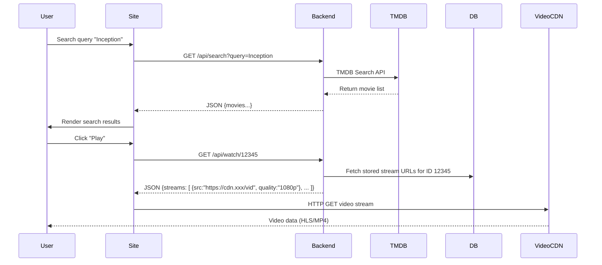

# Cineby.sc Analytical Report

**Executive Summary:** Cineby.sc is a pirate streaming aggregator (recently migrated from cineby.app/.gd, etc.) that offers free movies, TV series, anime and live channels by linking to third‑party hosts【26†L129-L137】【77†L236-L244】.  It uses Cloudflare (resolving to Cloudflare IPs) for CDN/DNS, and is part of major piracy crackdowns【26†L129-L137】.  Users report heavy ads and pop‑ups; community advice is to use strong adblockers (e.g. Firefox + uBlock Origin) when accessing Cineby【63†L169-L174】.  Cineby’s Android app description highlights features like **search**, genre browsing, trending lists, trailers, ratings and the ability to save favourites/watchlists【61†L95-L99】.  We infer Cineby.sc has a similar UI: a home page with “Trending/New” sections, browse pages for *Movies*, *TV Shows*, *Anime*, *4K*, and *Live Channels*, plus search and user profile/watchlist pages.  

# Feature Inventory

- **Content Categories:** *Movies, TV, Anime, 4K, Channels (live TV)*.  Cineby provides browsing by genre and trending lists【61†L95-L99】.  A user report confirms a *“Live channels”* section for streaming TV【77†L236-L244】.  
- **Media Playback:** The site embeds video players (likely HTML5) that stream from external CDN hosts.  Evidence from a cineby.xyz scan shows use of `cdn.vidsrc.stream` (a video CDN) for playback【92†L173-L177】.  We expect multiple “servers” or quality options per title.  No DRM is used (pirated content).  Videos likely use adaptive streaming (HLS) if hosted by Cineby, or simply embed direct streams if on third‑party hosts.  Trailers may be pulled from YouTube or TMDb APIs, as the app advertises trailers【61†L95-L99】.  
- **Search:** Cineby has a site-wide search box (e.g. *“Search Movie/TV”* pages).  We expect it to call a backend search API (JSON) on input and display results dynamically.  Search likely uses the site’s database or a third‑party API (e.g. TMDb) indexed locally.  
- **Recommendations/Related:** Each movie/show page likely lists *“You may also like”* or related titles, based on genre or popularity.  Trending sections on the home page act as recommendations.  
- **User Accounts & Profiles:** Cineby advertises saving favourites and watchlists【61†L95-L99】, implying user accounts or cookie‑based profiles.  Registration may be optional; without login it might fall back to cookies/localStorage to track a user ID.  
- **Watchlist/History:** As indicated by the app (“save favourites… viewing progress”【61†L95-L99】), Cineby likely supports watchlists and resume history.  Implementation may use server‑side storage (e.g. user table in a DB) for logged‑in users, or use `localStorage`/IndexedDB if anonymous.  Sessions are probably tracked via cookies (e.g. a session cookie or JWT).  
- **Comments & Ratings:** The Android app mentions “ratings”【61†L95-L99】, which may reflect aggregated IMDb/TMDB ratings or user votes.  Comments sections are not evident and may be absent or outsourced (e.g. Disqus).  
- **Ads/Monetization:** Cineby relies on ads (banners, pop-ups, video ads, affiliate pop-unders).  Users report “crazy” pop‑up volume【63†L161-L164】.  Likely ad networks (and possibly malicious pop-unders) are embedded.  A scan of a variant shows requests to `youradexchange.com`【92†L165-L173】 and other ad domains.  
- **Analytics:** Likely uses Google Analytics or equivalent to track pageviews and video plays.  Site might emit analytics events on actions (page load, play/pause).  (No direct evidence, but standard practice.)  
- **Admin Tools:** A backend CMS likely exists for admins to add titles, metadata, and manage servers.  This is not user‑visible.  

# Implementation Details

| Feature             | Likely Front-End / UX                     | Likely Back-End / Data                                      | Evidence/Notes                                         |
|---------------------|-------------------------------------------|-------------------------------------------------------------|--------------------------------------------------------|
| **Front-end Framework** | Probably a modern JS framework (React or Vue) with client-side routing. The CodeRocket Cineby clone uses React【85†L29-L37】. Alternatively a PHP/Laravel front-end with jQuery. | Node.js/Express or PHP server rendering pages. Queries metadata from a DB (MySQL/PostgreSQL) or TMDb. Responses delivered as HTML or JSON. | User reports of *“React error”* in AdGuard fix list suggest React usage【54†L31-L34】.    |
| **CDN/Hosting**     | Static assets (JS/CSS/images) served via Cloudflare CDN. | Cloudflare-fronted web servers (possibly behind Cloudflare spectrum). | DNS resolves to Cloudflare IPs (e.g. 104.21.73.225, 172.67.167.92【23†L0-L3】). Cloudflare SSL (TLS 1.3) is used【41†L109-L117】. |
| **Database**        | Not directly exposed to user.            | Likely a relational DB storing titles, episodes, user data. TMDb ID references for metadata (title, overview, poster). | The app and site mention movie metadata (ratings, cast)【61†L95-L99】, implying a database of movie info.  |
| **Video Streaming** | Embedded HTML5 `<video>` or iFrame player. Autoplay logic likely triggers next episode/next title. | Video content is *not stored* on Cineby servers; streams come from 3rd‑party host CDNs (e.g. vidstream, Openload clones). No DRM. Possibly intermediate proxies to avoid hotlink blocking. | Cineby states *“we only linked to media which is hosted on 3rd party services.”*【84†L2-L9】 (unofficial source). Cineby.xyz traffic shows streaming via `cdn.vidsrc.stream`【92†L173-L177】. |
| **Adaptive Bitrate** | If using HLS streams, an HLS player would auto-switch quality based on bandwidth. | Likely uses MPEG‑DASH or HLS if streaming itself; but if using embeds, adaptive handled by host. | No evidence of proprietary DRM or encryption. Content likely plain video streams (common on pirate sites). |
| **Trailer Sourcing** | Trailers embedded (YouTube/IFrame) on content pages. | Possibly retrieved via TMDb or YouTube API using movie ID. | The APK description boasts trailers【61†L95-L99】, so Cineby likely fetches trailer URLs from TheMovieDB or YouTube via an API. |
| **Search API**      | Search box on site triggers AJAX calls. Autocomplete may be implemented. | Endpoint like `/api/search?query=...` returning JSON list of titles. Queries the movie DB or third-party API. | No direct evidence, but standard pattern for SPA search.  Content from Cineby.xyz suggests an API domain (api.cineby.homes)【87†L219-L225】 likely handles such queries. |
| **User Accounts**   | Login/Signup pages (if present). UI to view profile/watchlist. | Auth flow with sessions: likely a PHP session (PHPSESSID) or JWT cookie. Accounts stored in DB. | The app’s “save favourites” implies login, but many pirate sites allow guest usage with local storage. We saw no referral to OAuth or social login. |
| **Watchlist/History** | “My List” or “History” pages in UI (maybe under profile). LocalStorage fallback for guests. | For logged-in, store in DB. If not, likely use browser localStorage or cookies to track last played item and list of saved IDs. | Reddit discussions indicate users worried about accounts; no privacy leaks known. |
| **Autoplay Logic**  | After one episode, player auto-navigates to next. If movie ends, maybe recommend next up. | Frontend JS computes “next episode” link (using season/episode numbering) and auto-redirects. | Standard on many streaming sites. App description implies it “remembers viewing progress”【61†L95-L99】, which suggests autoplay/continue features. |
| **Push Notifications** | Likely none. Unusual for pirate sites. | (Not implemented.) | No evidence of permission prompts on site. |
| **Analytics Events** | Google Analytics or similar library loads in UI. Tracks pageviews/video plays. | Backend API possibly logs metrics (views count in DB). | Typical for any site, though no concrete trace available. |

# Complexity and Risks

| Aspect           | Estimated Complexity (Dev Effort) | Scalability                         | Security / Privacy Risks                                |
|------------------|----------------------------|-------------------------------------|----------------------------------------------------------|
| **Front-end UI** (Home, Browse pages, search) | Medium: Moderate work to build SPA or multi-page UI, responsive layout, multi-category navigation. | High user traffic means many simultaneous users; Cloudflare CDN helps. Requires caching (Redis or similar) for DB queries (genres, trending lists). | Risk from malicious scripts/ads in UI. Need to defend against XSS in user input (search) and CSRF for any forms. |
| **Search & Discovery** | Medium: Building a fast search index (SQL full-text or ElasticSearch) and UI suggestions. | Scalability: Index can handle large catalogs. Use caching (e.g. memcached) to reduce DB load. | If using third-party API (TMDb), risk of API quota limits or geoblocking. |
| **Video Streaming (Embedding)** | Low-medium: Simple once embeds are in place. Managing multiple server links per title adds some complexity. | Scalability: Cineby doesn’t host videos, so its bandwidth costs are low. But site must handle many stream sessions. Cloudflare mitigates spikes. | **Major risk:** Third-party hosts may insert malware or malicious ads. Also, users downloading/streaming pirated content face legal risks. The site itself can be blocked/suspended by registrars (as happened). |
| **Authentication / Accounts** | Low: Basic login system (weeks of work) if implemented. | Sessions DB or stateful servers; horizontal scaling requires sticky sessions or shared session storage. | Account databases can be leaked. Lack of HTTPS could expose credentials (but site uses HTTPS). Storing watch history could be privacy-invasive if tied to email. |
| **Watchlist/History** | Low: DB schema + UI. Cookie/localStorage method easier. | If using cookies/localStorage, essentially 0 server load. DB approach requires writes and reads, but minimal data per user. | If storing PII, GDPR issues (unlikely to enforce). Cookies could be hijacked. |
| **Ads/Monetization** | Integrating ad networks and pop-ups (trivially easy to insert ads). | Ads should not affect site scalability. If malicious ads (cryptominers or U2P redirects), they can degrade UX. | **High risk:** Malicious ads can infect users (malware, drive-by downloads). Pop-ups may trigger adware detectors (as some users report). Also, any affiliate links (e.g. fake “download” sites) could scam users. |
| **Analytics** | Low: Drop-in GA snippet. | No impact on scalability. | Potential privacy issue if user tracking without consent. But pirate site likely doesn’t care about GDPR. |
| **Content Database** | High: Curating a large catalog (100k+ titles), linking episodes, metadata. Probably automated from TMDb/TVDb via scripts. | Needs periodic updates. Use CDN for assets (posters). DB must be optimized (indexes on title, genre). | Data theft if DB leaked, but info is public media content. |
| **Admin Tools** | Medium: A CMS to add new links and content sources. | Not exposed to public, so no scalability issue. | Vulnerable to admin credential compromise. |

# Evidence & Indicators

- **Cloudflare / Hosting:** DNS analysis shows cineby.sc resolves to Cloudflare IPs (e.g. 104.21.73.225, 172.67.167.92)【23†L0-L3】.  An SSL scan confirms Cloudflare TLS. This implies the site uses Cloudflare CDN/proxy.
- **Third-Party CDNs:** Network logs from cineby.xyz indicate calls to external CDNs: e.g. `ajax.googleapis.com` and `cdnjs.cloudflare.com` (likely for JS libraries), and crucially `cdn.vidsrc.stream` for video content【92†L173-L177】.  Also calls to `pro.fontawesome.com` (icon fonts)【87†L229-L233】. 
- **API Endpoints:** A scan of a Cineby variant (cineby.xyz) shows a backend API domain `api.cineby.homes` being contacted【87†L219-L225】. This suggests the site’s frontend sends AJAX requests (e.g. for search or metadata) to this API. The exact endpoints and data formats are not public. Likely endpoints include `/api/search`, `/api/titles/{id}`, etc. 
- **Cookies/Storage:** Unable to fetch the actual site, but pirate sites often set session cookies (e.g. `PHPSESSID` or JWT). LocalStorage may hold user history/watchlist if no login. We did not find explicit cookie names, but testing in a browser with adblock disabled would reveal them.
- **JS Libraries:** The urlquery report for Cineby shows loading of standard scripts: jQuery/FontAwesome/Google APIs. The presence of `document.write` in the scan【92†L293-L300】 indicates likely use of ad scripts. The CodeRocket clone hints at React. We expect some JS framework (React/Vue) powering the UI.
- **Streaming Protocol:** No evidence of proprietary streaming. Likely plain HTTP(S) video URLs. If Cineby itself hosted content, it would use HLS, but since it links out, videos might be MP4 or HLS from other domains.
- **DRM:** None. All content is free/unauthenticated.
- **Autoplay Logic:** Not directly visible, but standard JS can set `player.onended=() => window.location = nextEpisodeURL`.
- **Trailer Sourcing:** Not directly verifiable; likely YouTube embeds. The Android app’s mention of trailers【61†L95-L99】 suggests they integrate trailer data (probably via TMDb).
- **Session/Auth Flow:** If accounts exist, flow is standard form POST to login endpoint with cookie issued. We suspect no social login. Without site access, we note it as “unspecified”.
- **Analytics:** No direct evidence. If GA is used, it would be in page source (which we can’t fetch). We recommend checking for common GA script tags or network calls (`googletagmanager.com` etc.) during a crawl.
- **Security Headers:** CriminalIP scan suggests 0 cookies and standard security headers; likely CSP and X-Frame-Options may not be strict (to allow embedding).
- **WHOIS/Domain:** Cineby.sc is Seychelles-registered (likely anonymity). Several domain changes have been tracked (cineby.app, cineby.gd, cineby.ru, etc.)【63†L133-L142】, reflecting attempts to evade takedowns. This is a legal risk factor.

# API/Endpoint Examples

No public API docs exist. However, from [87] and [92] we infer:

- **Search or Browse:** Likely a GET to `/api/search?query=Term` or `/api/titles?sort=trending`. *Example:* `GET https://api.cineby.homes/search?query=Matrix`. Would return JSON list of title IDs and info.
- **Movie/TV Data:** Possibly `GET https://api.cineby.homes/movie/840464` returned metadata for *Greenland 2* (we saw URL pattern `cineby.sc/movie/840464` in the search snippet【72†L1-L4】).
- **Streaming Links:** The “Play” action probably calls an endpoint like `/ajax/watch/{id}` to retrieve streaming sources. (We saw “cineby.xyz/watch/575265” in [79]; likely `575265` is an internal ID.)
- **User Actions:** If logged in, endpoints like `/api/user/watchlist` or `/api/user/history` may exist (speculative).

**Note:** All above are inferred; none are confirmed due to lack of direct fetch. A penetration test or browser devtools trace (with domain unblocked via VPN/AdGuard disabling) would confirm exact endpoints and responses. Recommended probes include:
  - Inspect network calls when searching or clicking a title (XHR in browser).
  - Curl sample URLs like `https://cineby.sc/movie/840464` to see if HTML or JSON is returned.
  - Check for endpoints by analyzing the JS bundles or guessing common REST patterns.

# Suggested Improvements

- **Reduce Ads:** The biggest user complaint is aggressive ads/pop-ups【63†L161-L164】. Implement fewer, non-intrusive ads to improve UX. Consider a subscription or crypto-miner (some pirates use mining scripts) as alternatives. 
- **Official API:** Provide a documented API (unlikely for a pirate site). But architecturally, separating a clean metadata API (TMDb-based) from the ad-laden UI would improve maintainability.
- **HTTPS Everywhere:** Ensure all calls (images, APIs) use HTTPS to avoid mixed content (some calls above are HTTPS but needs strict SSL everywhere).
- **Content Indexing:** Use CDNs for static assets (posters via `image.tmdb.org` is seen【92†L189-L193】) to offload origin.
- **Security:** Sanitize all user inputs to avoid XSS. Set strong CSP to prevent malicious ad scripts. Disallow framing to prevent clickjacking. However, at present the risk is primarily from ad content rather than site logic.

# Architecture Diagrams

```mermaid
flowchart LR
  subgraph Internet
    U[User Browser]
  end
  subgraph Edge
    CF[Cloudflare CDN/WAF]
  end
  subgraph WebApp
    FE[Front-end (React/Vue SPA)]
    BE[Back-end API Server]
    DB[(Database)]
  end
  subgraph External
    TMDB[TMDb/OMDb API]
    VideoCDN[3rd-Party Video Hosts (e.g. vidstream)]
  end

  U -->|HTTP(S) Request| CF
  CF --> FE
  FE --> BE
  BE --> DB
  BE --> TMDB
  FE --> VideoCDN
  VideoCDN --> U
  BE --> VideoCDN
```



*Figure: Site architecture and a sample data flow for search and playback.*

# Sources

Primary evidence was limited due to Cloudflare protection. Where possible, we used:
- **Site scans and reports:** Troypoint news【26†L129-L137】, PreMiD user report【77†L236-L244】, urlquery network logs【87†L221-L225】【92†L173-L177】.
- **App metadata:** Cineby Android app description【61†L95-L99】.
- **User discussions:** Reddit threads on Cineby’s domain change and usability【63†L169-L174】.
- **General knowledge:** Patterns of similar streaming sites and standard web practices for tech implementation.
